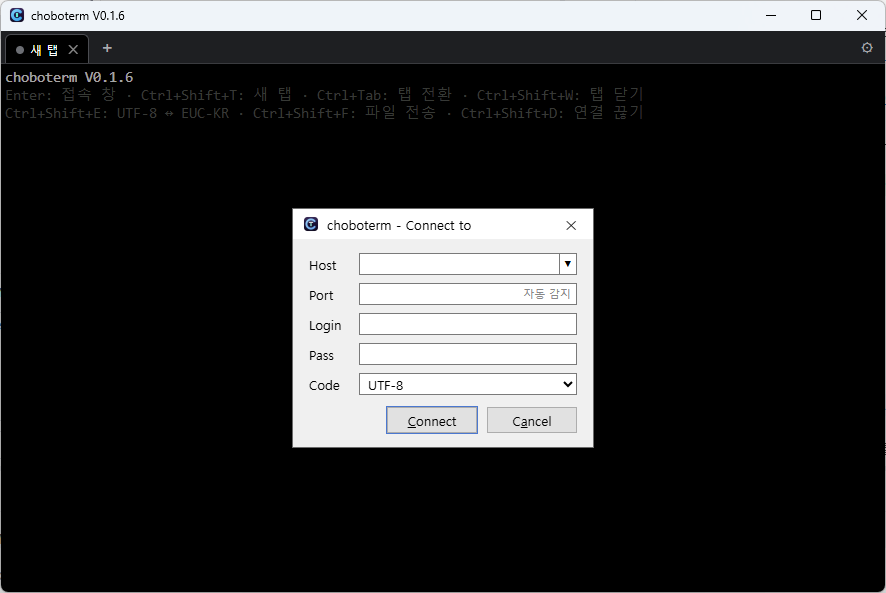
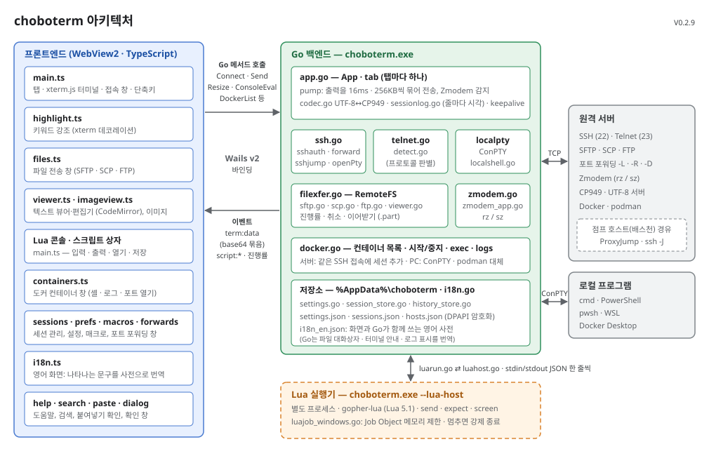

# choboterm V0.2.8

옛 ZTerm처럼 간결하게 쓸 수 있는 Windows용 SSH / Telnet / FTP 터미널입니다.
Go + [Wails v2](https://wails.io) + [xterm.js](https://xtermjs.org)로 만들었습니다. 텍스트 뷰어는 [CodeMirror 6](https://codemirror.net)(MIT)을 씁니다.

**[⬇ 최신 버전 다운로드 (choboterm.exe)](https://github.com/chobocho/choboterm/releases/latest/download/choboterm.exe)** · [소개 페이지](https://chobocho.github.io/choboterm/) · [모든 버전](https://github.com/chobocho/choboterm/releases)

설치 없이 내려받아 실행하면 됩니다. 코드 서명이 없어 처음 실행할 때 "Windows의 PC 보호" 창이 뜨면 **추가 정보 → 실행**을 누르세요.



## 기능

- **영어 화면 (English UI)**: 설정 창(`Ctrl+Shift+O`)의 "언어 (Language)"에서 자동 / 한국어 / English를 고릅니다. 자동은 Windows 표시 언어를 따릅니다(한국어 Windows면 한국어, 아니면 영어). 다시 시작하면 적용됩니다.
  - 메뉴, 창, 알림, 오류 메시지, 파일 대화상자 제목, 터미널에 나오는 안내까지 영어로 바뀝니다. F1 도움말은 처음에 화면 언어로 열립니다.
  - 사전은 `frontend/src/i18n_en.json` 하나이고, Go와 화면이 함께 씁니다. 터미널 출력과 편집 중인 파일 내용은 번역하지 않습니다.
- **탭**: MobaXterm처럼 여러 접속을 탭으로 띄웁니다. 탭마다 접속, 인코딩, 파일 전송이 따로 동작합니다.
  - 탭 상태 점: 초록 = 접속 중, 회색 = 끊김, 주황 = 파일 전송 중. 보고 있지 않은 탭에 새 출력이 오면 탭 이름이 강조됩니다.
  - `+` 버튼이나 탭 바 빈 곳 더블클릭으로 새 탭, 가운데 클릭으로 닫기, 끌어서 순서 바꾸기
  - 창 제목 끝에 지금 탭의 화면 그리기 방식을 표시합니다: `⚡GPU` = GPU 가속(WebGL), `🐢CPU` = GPU를 쓸 수 없어 일반 방식으로 그림(소프트웨어 WebGL만 있거나 GPU가 초기화된 경우)
  - 탭 우클릭 메뉴: 다시 연결, 복제(같은 서버로 새 탭), 파일 전송, 연결 끊기, 탭 닫기
  - **분할 창**: `Ctrl+Shift+\`(오른쪽, `|` 모양) / `Ctrl+Shift+-`(아래) 또는 탭 우클릭 메뉴로 탭 안을 나눕니다. 새 창마다 따로 접속하며 접속 창에는 지금 서버가 미리 채워져 있어 `Enter`만 누르면 됩니다. 몇 번이든 더 나눌 수 있습니다.
    - 클릭하거나 `Alt+방향키`로 다른 창으로 옮깁니다(분할된 탭에서만, 아니면 방향키는 프로그램에 전달). 지금 창은 파란 테두리로 표시됩니다.
    - 경계선을 끌어 크기를 바꾸고, 더블클릭하면 반반으로 돌아갑니다.
    - 탭 바에는 분할된 창들이 한 묶음(파란 배경)으로 나타나고 창마다 상태 점과 이름이 붙습니다. `Ctrl+Shift+W`나 ✕는 그 창만 닫습니다.
  - 접속 창과 파일 전송 창은 탭마다 따로 열립니다. 창이 떠 있어도 탭을 바꿀 수 있고, 돌아오면 입력값·폴더·전송 상태가 그대로 남아 있습니다. 파일 전송은 다른 탭을 보는 동안에도 계속됩니다.
- **세션 관리**: 자주 쓰는 접속에 이름과 그룹(한 단계)을 붙여 저장합니다. 최근 접속 기록(20개)과 달리 지워지지 않습니다.
  - 접속 창의 `☆ Save`(`Alt+S`)나 탭 우클릭 메뉴의 "세션으로 저장"으로 저장합니다. 비밀번호도 저장할 수 있으며 Windows DPAPI로 암호화합니다(현재 Windows 사용자만 풀 수 있음).
  - Host 칸의 ▼ 목록 맨 위에 그룹별로 나옵니다. Host 칸에 입력하면 이름·주소·그룹으로 걸러 보여 주므로 세션이 많아도 몇 글자로 고를 수 있습니다.
  - 세션으로 연 탭에는 세션 이름이 붙습니다.
  - **세션 관리 창**: `Ctrl+Shift+H` 또는 탭 바 오른쪽 ★ 버튼. 세션을 고치기·추가·복제·삭제·찾기 하고, `Enter`로 접속합니다. "그룹 전체 열기"는 그룹의 세션을 모두 탭으로 엽니다. 고친 내용은 바로 저장됩니다.
  - **가져오기 · 내보내기**: PuTTY에 저장된 SSH·Telnet 세션을 `PuTTY` 그룹으로 가져옵니다. 다른 PC로 옮길 때는 파일로 내보내고 가져옵니다(비밀번호는 내보내지 않음).
- **프로토콜 선택**: 22 = SSH, 21 = FTP, 23 = Telnet. 그 밖의 포트(예: Termux의 8022)는 접속하자마자 서버의 첫 인사말로 자동 판별합니다(`SSH-` → SSH, `220` → FTP, 그 외 → Telnet). 먼저 말을 걸지 않는 Telnet 서버는 판별에 2초가 걸립니다.
- **SSH**: 비밀번호, keyboard-interactive, `~/.ssh` 개인키(id_ed25519 / id_ecdsa / id_rsa), SSH 에이전트 인증
  - **2단계 인증(OTP)**: 서버가 keyboard-interactive로 묻는 `Verification code:`, `One-time password:`, Duo 같은 질문은 서버가 보낸 그대로 창에 보여 주고 답을 보냅니다. 첫 `Password:` 질문은 접속 창의 Pass로 자동으로 답합니다. Pass를 비워 두면 비밀번호도 창에서 묻습니다.
  - **SSH 에이전트**: Windows용 OpenSSH 에이전트(`ssh-agent` 서비스), PuTTY의 Pageant, `SSH_AUTH_SOCK`에 올려 둔 키를 먼저 씁니다. 따로 설정할 것은 없습니다.
  - **암호 걸린 개인키**: 서버가 그 키를 받아들일 때만 암호를 묻습니다(맞지 않는 서버에서는 묻지 않음). 한 번 푼 키는 choboterm을 끌 때까지 기억해 다시 연결·분할 창·자동 재접속 때 다시 묻지 않습니다. 공개키가 들어 있지 않은 옛 PEM 키는 옆의 `.pub` 파일을 쓰고, 그것도 없으면 접속할 때 바로 묻습니다(취소하면 그 키는 건너뜀).
  - **`~/.ssh/config` 이름으로 접속**: Host 칸에 config에 적어 둔 이름(예: `busan`)이나 명령처럼 `ssh busan`, `ssh -p 2222 user@busan`을 입력하면 `HostName` / `Port` / `User` / `IdentityFile`을 읽어 Port와 Login을 채우고 접속합니다. 탭 이름과 접속 기록에는 `busan`이 남습니다.
    - Host 칸에 포커스를 두면 툴팁으로 입력 예와 등록된 이름을 보여 주고, config 이름을 입력하면 실제 접속할 `user@주소:포트`를 보여 줍니다. config의 이름들은 ▼ 목록에도 `ssh config`로 표시됩니다.
    - `IdentityFile`의 키를 먼저 시도하고, 안 되면 기본 키와 비밀번호를 씁니다. `Host *.corp` 같은 패턴 항목도 적용합니다. `Match`는 아직 지원하지 않습니다.
  - **점프 호스트 (ProxyJump)**: 배스천 서버를 거쳐 내부 서버에 접속합니다. 접속 창(과 세션 관리 창)의 `Jump` 칸에 `user@bastion` 또는 `bastion:2222`를 쓰고, 여러 단계는 `a,b`처럼 쉼표로 잇습니다. 비워 두면 `~/.ssh/config`의 `ProxyJump`를 쓰고(칸에 흐리게 표시), Host 칸에 `ssh -J bastion web`을 써도 됩니다. `none`이면 config에 있어도 쓰지 않습니다.
    - 점프 호스트 이름이 config의 Host면 그 HostName·User·Port·IdentityFile을 씁니다. 로그인은 키·에이전트로 하고, 비밀번호가 필요하면 "(점프 호스트 user@bastion)"이라고 붙여 따로 묻습니다. 호스트 키도 단계마다 known_hosts로 확인합니다.
    - 파일 전송(SFTP)·포트 포워딩도 같은 경로로 됩니다. Jump 값은 접속 기록과 세션에 함께 저장됩니다.
  - `~/.ssh/known_hosts`로 호스트 키 확인. 처음 접속하는 호스트는 지문을 보여 주고 신뢰할지 묻고, 키가 바뀐 호스트는 차단합니다.
- **로컬 셸 (cmd / PowerShell / WSL)**: 접속 창의 Host에 `cmd`, `powershell`, `pwsh`, `wsl`(또는 `wsl -d Ubuntu`처럼 인자 포함)을 쓰면 이 PC의 셸을 탭에서 엽니다. ▼ 목록에도 설치된 셸이 `로컬 셸`로 나옵니다. 이때 Port / Login / Pass / Code 칸은 쓰지 않으므로 비활성화됩니다.
  - Windows의 의사 콘솔(ConPTY)을 쓰므로 Windows 10 1809 이상이 필요합니다. 사용자 폴더에서 시작하며 항상 UTF-8입니다.
  - 분할 창, 매크로, 세션 로그, 스크롤백 검색이 그대로 되고, WSL에서는 `sz` / `rz`(Zmodem)로 파일을 주고받을 수 있습니다. `exit`로 끝나면 `Enter`로 다시 엽니다.
- **Telnet**: NAWS / TTYPE / ECHO / SGA / BINARY 협상, `login:` / `password:` 프롬프트 자동 로그인
  - 비밀번호를 기억해 두었다가 Host를 고르면 자동으로 채웁니다. Windows DPAPI로 암호화해 저장하므로 현재 Windows 사용자만 풀 수 있습니다. Pass를 비우고 접속하면 저장된 비밀번호를 지웁니다.
- **FTP**: 접속하면 파일 전송 창이 바로 열립니다. 창을 닫아도 탭을 닫기 전까지 연결이 유지되며 `Ctrl+Shift+F`로 다시 엽니다. Login을 비워 두면 anonymous로 로그인합니다.
- **SFTP / SCP**: SSH 접속 중 `Ctrl+Shift+F`로 파일 전송 창을 엽니다. 다시 로그인할 필요가 없습니다.
  - 터미널의 현재 폴더에서 열립니다. 커서 줄의 프롬프트(`user@host:~/src$`, `~/src $` 등), 셸이 보내는 OSC 7, 창 제목 순으로 폴더를 찾고, 찾지 못하면 홈 폴더에서 엽니다.
- **파일 전송 창** (SFTP / SCP / FTP 공통)
  - `Ctrl+클릭` / `Shift+클릭` / `Ctrl+A`로 여러 개를 선택해 한 번에 받거나 지웁니다.
  - 여러 개나 폴더를 받을 때는 저장할 폴더를 고르면 하위 폴더까지 받습니다. 같은 이름이 있으면 `이름 (1)`로 저장합니다.
  - Windows 탐색기에서 파일·폴더를 목록으로 끌어 놓으면 업로드합니다(폴더는 하위까지).
  - `Delete` 삭제(폴더는 안의 내용까지, 확인 후), `F2` 이름 바꾸기, `F7` 새 폴더, `Shift+F4` 새 파일(빈 파일, 같은 이름이 있으면 만들지 않음), 우클릭 메뉴
  - `F3` 보기 / `F4` 편집: 원격 텍스트 파일을 받지 않고 바로 엽니다(앞 10MB까지, 그보다 크면 보기만). UTF-8 / EUC-KR(CP949)을 자동으로 판별하고, 글자가 깨지면 인코딩을 직접 골라 다시 읽습니다. `Ctrl+F` 찾기·바꾸기, 줄 바꿈 켜기·끄기, 보이는 내용을 UTF-8 또는 EUC-KR로 바꿔 내 PC에 저장할 수 있습니다.
  - 이미지(JPG · PNG · GIF · BMP · WebP · SVG · ICO, 30MB까지)는 `F3`으로 이미지 보기 창에서 엽니다. 처음에는 창에 맞춰 보여 주고, `←` `→`(`PgUp` `PgDn`, `Space`)로 같은 폴더의 이전·다음 이미지, `0` 맞춤, `1` 원본 크기(더블클릭으로 전환), `+` `-`·`Ctrl+휠` 확대·축소, 큰 이미지는 끌어서 이동, `Esc` 닫기. 투명한 부분은 바둑판 무늬로 보입니다.
  - 편집한 내용은 `Ctrl+S`로 서버에 바로 저장합니다. 인코딩·줄바꿈(CRLF/LF)·BOM은 원래대로 유지합니다. 연 뒤에 서버에서 파일이 바뀌었으면(크기·수정한 날짜) 덮어쓰기 전에 묻고, 인코딩에 없는 글자나 깨진 글자가 있으면 저장 전에 알려 줍니다.
  - **이어받기 · 이어 올리기** (SFTP · FTP): 받는 중인 파일은 `이름.part`로 저장했다가 다 받으면 원래 이름으로 바꿉니다. 연결이 끊기거나 취소해서 `.part`가 남으면, 다음에 같은 파일을 같은 곳에 받을 때 "이어받기 / 처음부터"를 묻고 받은 곳부터 이어서 받습니다. 올리다 끊긴 파일도 다시 올릴 때 "이어 올리기 / 처음부터"를 묻습니다(choboterm을 다시 켜기 전까지, 같은 로컬 파일일 때만 — 서버의 작은 파일이 옛 버전일 수도 있어서).
  - 서버에 SFTP가 없으면(Dropbear, 공유기, 임베디드 장비 등) 자동으로 SCP로 바꿔 씁니다. 이때 폴더 목록은 `ls`로 가져옵니다.
- **Zmodem**: 터미널에서 `sz 파일` / `rz`를 실행하면 자동으로 전송합니다. 원격 서버에 lrzsz가 설치되어 있어야 합니다.
- **EUC-KR (CP949)**: 접속 창의 Code에서 선택하거나 접속 중 `Ctrl+Shift+E`로 전환합니다.
  - EUC-KR 모드에서는 `─ │ ■ ○ ※` 같은 특수문자를 옛 터미널처럼 2칸 폭으로 그립니다.
  - 글꼴은 인코딩별로 설정 창에서 고릅니다(기본: UTF-8 = D2Coding, EUC-KR = 굴림체). EUC-KR에서 D2Coding 등을 골라도 `▒ ─ ■` 같은 기호는 굴림체로 그려 틈 없이 이어집니다.
  - FTP 파일 이름과 Zmodem 파일 이름에도 같은 인코딩을 적용합니다.
- **복사 / 붙여넣기**: PuTTY처럼 마우스로 선택하면 바로 복사되고, 우클릭하면 붙여넣습니다. `Ctrl+Shift+C` / `Ctrl+Shift+V`도 됩니다.
  - 여러 줄을 붙여넣을 때는 줄마다 명령이 실행될 수 있으므로 먼저 내용을 보여 주고 확인을 받습니다. "다시 묻지 않기"로 끌 수 있습니다.
  - mc, htop처럼 마우스를 쓰는 프로그램에서는 Shift+우클릭으로 붙여넣습니다.
- **글꼴 크기**: `Ctrl+휠`, `Ctrl+=` / `Ctrl+-`로 바꾸고 `Ctrl+0`으로 되돌립니다. 모든 탭에 적용되고 다음 실행 때도 유지됩니다.
- **키워드 강조**: 출력에 나온 `error` · `fail` · `오류` · `실패` 같은 단어는 빨강, `warning` · `경고`는 노랑, `success` · `성공`은 초록 배경으로 표시합니다. 설정 창(`Ctrl+Shift+O`)의 "키워드 강조"에서 색마다 단어를 쉼표로 적어 바꾸거나 끕니다.
  - 영어 단어는 단어 단위로, 대소문자 구분 없이 찾습니다(`error`는 `Error`에 맞고 `errorless`에는 맞지 않음). 한글은 들어 있기만 하면 표시합니다.
  - 서버가 보낸 출력은 바꾸지 않고 화면 위에 칠하기만 하므로, 프로그램의 색은 그대로이고 로그 파일에도 영향이 없습니다. vim · htop 같은 전체 화면 프로그램 안에서는 강조하지 않습니다.
- **스크롤백 검색**: `Ctrl+Shift+S`로 검색 막대를 엽니다. 입력하는 대로 가장 최근 출력부터 찾고, 모든 결과를 강조합니다. `Enter`는 위로(이전 출력), `Shift+Enter`는 아래로, `Alt+C`는 대소문자 구분, `Alt+R`은 정규식입니다.
- **링크 열기**: 화면에 나온 `http://` / `https://` 주소를 `Ctrl+클릭`하면 기본 브라우저로 엽니다. 그냥 클릭은 선택용으로 남겨 둡니다.
- **연결 유지 / 자동 재접속**: SSH는 `keepalive@openssh.com`, Telnet은 NOP를 60초마다 보내 공유기·방화벽이 쉬는 연결을 끊지 않게 하고, 3번 연속 응답이 없으면 끊긴 것으로 봅니다.
  - 네트워크가 끊기면 3·5·10·20·30초 간격으로 최대 10번 다시 연결합니다. 화면 내용은 그대로 둡니다. `Enter`로 바로 연결, `Esc`로 취소합니다.
  - `exit`처럼 서버가 정상적으로 끝낸 연결은 다시 연결하지 않습니다.
- **설정 창**: `Ctrl+Shift+O` 또는 탭 바 오른쪽 ⚙ 버튼. 글꼴(UTF-8 / EUC-KR별)과 크기, 색 테마, 커서 모양(블록 / 밑줄 / 세로선)과 깜빡임, 스크롤백 줄 수(기본 5000), 여러 줄 붙여넣기 확인, 연결 유지 간격(0 = 끄기), 자동 재접속, 세션 로그(자동 기록, 일반 텍스트, 폴더)를 바꿉니다.
- **포트 포워딩 (SSH)**: `Ctrl+Shift+P` 또는 탭 우클릭 메뉴로 포워딩 창을 엽니다.
  - 로컬(`-L`): 이 PC의 포트 → 서버를 거쳐 대상으로. 예) `127.0.0.1:15432 → localhost:5432`로 서버의 DB에 접속
  - 원격(`-R`): 서버의 포트 → 이 PC를 거쳐 대상으로
  - 동적(`-D`): 이 PC의 포트가 SOCKS5 프록시가 되어 서버를 거쳐 접속
  - 규칙은 호스트별로 접속 기록에 저장되어 다음 접속(자동 재접속 포함) 때 자동으로 다시 열립니다. 포트가 이미 사용 중이면 규칙은 남기고 오류를 보여 줍니다.
  - 같은 서버에 탭을 여러 개 열면 규칙은 한 탭에서만 수신하고, 다른 탭에는 "대기"로 표시됩니다. 수신하던 탭이 끊기면 대기 중인 탭이 이어받고, 어느 탭에서 추가·삭제해도 모든 탭에 반영됩니다.
  - 대상은 서버에서 본 주소입니다. 예) 서버에서 `localhost`로만 열린 Jupyter(8888)는 `127.0.0.1:8888 → 127.0.0.1:8888`
  - 상태 칸에 지금 열려 있는 연결 수가 나오고, 창 아래에는 같은 포워딩을 여는 `ssh` 명령어(`-L`/`-R`/`-D`, `-J`, `-p` 포함)가 나와 복사할 수 있습니다.
- **도커 컨테이너**: `Ctrl+Shift+J` 또는 탭 우클릭 메뉴로 컨테이너 창을 엽니다. 지금 탭의 SSH 서버, 또는 이 PC(Docker Desktop)의 컨테이너를 보여 줍니다. docker가 없으면 podman을 씁니다.
  - **셸 열기**(`Enter` / 더블클릭): 새 탭에서 `docker exec -it` (bash가 있으면 bash, 없으면 sh). **로그 보기**: 새 탭에서 `docker logs -f --tail 200`
  - 서버의 컨테이너 탭은 그 탭의 SSH 접속에 세션을 하나 더 여는 방식이라 다시 로그인하지 않습니다. 원래 탭의 접속이 끊기면 함께 닫히고, `Enter`로 다시 엽니다.
  - 시작 / 중지 / 재시작(중지·재시작은 확인 후), 중지된 컨테이너 표시, 새로고침(`F5`)
  - **포트 열기**: 서버의 게시된 포트를 이 PC의 같은 포트로 포워딩(`-L`)하고 브라우저로 엽니다. 이 PC의 컨테이너는 바로 `http://localhost:포트`를 엽니다.
  - 서버 사용자가 docker 그룹에 없으면 권한 오류와 함께 `sudo usermod -aG docker $USER` 안내가 나옵니다.
- **매크로**: `Ctrl+Shift+M`으로 매크로 창을 열어 자주 쓰는 명령을 저장해 두고 보냅니다(목록에서 `Enter` / 더블클릭).
  - 매크로마다 `F2`~`F12`, `Shift+F1`~`F12`, `Ctrl+F1`~`F12` 중 하나를 지정하면 그 키로 바로 보냅니다. 지정하지 않은 키는 mc, htop 같은 프로그램에 그대로 전달됩니다.
  - 내용의 줄바꿈은 `Enter`로 보내고, `\t`(Tab), `\e`(Esc), `\xHH`(예: `\x03` = Ctrl+C), `\\`(역슬래시)를 쓸 수 있습니다.
- **Lua 스크립트**: 자동 로그인, 반복 명령처럼 출력을 보고 입력하는 일을 Lua(5.1 문법, [gopher-lua](https://github.com/yuin/gopher-lua))로 자동화합니다.
  - 매크로 창에서 종류를 "Lua 스크립트"로 고르면 그 매크로(지정한 F키 포함)가 스크립트로 실행됩니다. 탭 우클릭 메뉴의 "Lua 스크립트 실행..."은 `문서\choboterm\scripts`의 `.lua` 파일을 실행합니다(처음 열 때 예제 3개를 넣어 둠).
  - 쓸 수 있는 함수: `send(문자열)` 입력 보내기(`"\r"` = Enter), `expect(패턴, 초)` 출력에 Lua 패턴이 나올 때까지 기다리기(색·제어 코드는 빼고 비교, 시간이 지나면 `nil`, 기본 30초), `sleep(밀리초)`, `screen()` 지금 화면의 글자, `print(...)`. 그 밖에 `string` · `table` · `math` · `os.time/clock/date`가 있고, 파일(`io`)·명령 실행·`require`는 쓸 수 없습니다.
  - **Lua 콘솔**(`Ctrl+Shift+K` 또는 탭 우클릭 → "Lua 콘솔"): 한 줄씩 입력해 바로 실행하는 REPL입니다. 창 오른쪽 아래에 열리고, 닫을 때까지 변수와 함수가 남습니다. `1 + 2`나 `x`처럼 식을 입력하면 값을 보여 주고, `print`도 그 자리에 나옵니다. `Enter` 실행, `Shift+Enter` 줄바꿈, `↑` `↓` 이전 입력, `Ctrl+C`(또는 "중지")는 실행 중인 입력만 멈춥니다(콘솔과 변수는 그대로). `Ctrl+O`(또는 "열기")는 Lua 파일을 입력창으로 불러와 보여 주고(고친 뒤 `Enter`로 실행), `Ctrl+S`(또는 "저장")는 지금까지의 입력과 출력을 텍스트 파일로 저장합니다. `Esc`는 터미널로 돌아가고, ✕로 닫습니다. 위쪽 테두리를 마우스로 끌면 높이를 바꿀 수 있고(최소: 제목줄·입력줄·출력 3줄, 최대: 창 높이의 80%), 바꾼 높이는 다음에 열 때도 그대로 씁니다. 콘솔의 `expect`는 입력을 실행한 뒤의 출력만 봅니다.
  - 실행 중인 탭에는 `▶ 0:42`처럼 걸린 시간이 붙고, 창 오른쪽 아래 상자에 `print` 출력과 결과(끝 · 멈춤 · 오류와 줄 번호)가 나옵니다. 오류는 닫을 때까지 남습니다. 멈추려면 탭 우클릭 → "스크립트 중지". 연결이 끊기거나 탭을 닫아도 멈춥니다.
  - **스크립트가 choboterm을 멈추게 하지 않습니다**: 스크립트는 별도 프로세스(`choboterm.exe --lua-host`)에서 돌고, 메모리는 256MB로 제한됩니다. 무한 루프, 메모리 폭주, 오류가 나도 그 스크립트만 끝나고 터미널은 그대로입니다. 스크립트가 출력을 따라오지 못해도 터미널 화면은 늦어지지 않습니다.
- **세션 로그**: `Ctrl+Shift+L` 또는 탭 우클릭 메뉴로 그 탭이 받은 출력을 파일에 계속 저장합니다. 기록 중인 탭에는 빨간 점이 붙습니다.
  - 파일은 `문서\choboterm\logs\호스트_포트_날짜_시간.log`로 만들어집니다. 폴더는 설정 창에서 바꿉니다. 탭 메뉴의 "로그 폴더 열기"로 탐색기에서 엽니다.
  - 기본은 일반 텍스트입니다. 색상·제어 코드를 빼고, `\r`로 덮어쓴 진행률 표시는 마지막 상태만 남깁니다. 설정에서 끄면 받은 그대로(이스케이프 코드 포함) 저장해 `cat`으로 다시 볼 수 있습니다.
  - 설정의 "접속할 때마다 자동으로 로그 기록"을 켜면 SSH·Telnet 접속마다 새 파일을 만듭니다. 다시 연결해도 탭을 닫기 전까지 같은 파일에 이어 쓰고, 접속·끊김 시각을 구분선으로 남깁니다.
  - **줄마다 시각**: 각 줄 앞에 그 줄이 들어오기 시작한 시각을 `[2026-10-09 21:30:15.123] ` 형식(밀리초까지)으로 붙입니다. 장애를 분석할 때 몇 시에 나온 출력인지 알 수 있습니다. 기본으로 켜져 있고, 설정 창의 "줄마다 받은 시각 기록"으로 끕니다. 원본(색상·제어 코드 포함)으로 저장할 때도 붙습니다.
- **색 테마**: 설정 창에서 고르면 모든 탭에 바로 적용됩니다. 기본(검정), Campbell(Windows 터미널), PuTTY, Tango Dark, One Half Dark, Dracula, Gruvbox Dark, Solarized Dark, 밝은 배경의 Solarized Light / One Half Light, 옛 녹색 모니터 느낌의 허큘리스(검은 배경 · 녹색 글자)와 허큘리스 반전(녹색 배경 · 검은 글자)이 있고, 고르는 동안 미리 보기로 16색을 보여 줍니다.
  - **서버별 테마**: 탭 우클릭 메뉴의 "색 테마 (이 서버)"에서 고르면 그 서버(호스트+포트)에 저장되어, 다시 접속하거나 복제·분할할 때도 같은 테마로 열립니다. 같은 서버에 접속한 다른 탭에도 바로 적용됩니다. 운영 서버를 다른 색으로 구분할 때 좋습니다. "기본값"을 고르면 설정 창의 테마로 돌아갑니다.
- **반투명**: 설정 창의 "반투명"에서 고르고, 불투명도(20~100%)는 막대로 조절합니다. 막대를 움직이는 동안 바로 보이고, 취소하면 원래대로 돌아갑니다.
  - **창 전체**: Xshell · Tera Term처럼 탭 바와 터미널이 글자까지 비칩니다. 설정 · 접속 · 질문 · 파일 창 같은 팝업과 메뉴는 불투명하게 남습니다. 제목 표시줄은 Windows가 그리므로 불투명합니다.
  - **배경만**: Windows 터미널처럼 터미널 배경만 비치고 글자는 선명합니다. 글자를 선명하게 그리려고 이 방식에서는 기본으로 GPU 가속을 쓰지 않습니다(창 제목에 🐢CPU). "배경만에서도 GPU로 그리기"를 켜면 GPU로 그립니다(⚡GPU, 빠르지만 글자가 조금 거칠 수 있음).
  - 두 방식 모두 다시 시작하지 않아도 바로 적용됩니다.
- **창 위치 기억**: 창 크기·위치·최대화 상태를 닫을 때 저장해 다음 실행 때 그대로 엽니다. 모니터를 뺀 경우처럼 저장된 위치가 화면 밖이면 보이는 곳으로 옮깁니다.
- **최근 접속 기록**: Host 목록에 최근 20개를 저장합니다. 비밀번호는 Telnet만, 암호화해서 저장합니다. 서버별 색 테마와 포트 포워딩 규칙은 기록에서 밀려나도 지워지지 않습니다.

X11 포워딩은 지원하지 않습니다.

## 단축키

| 키 | 동작 |
|---|---|
| `Enter` (연결이 없는 탭에서) | 그 탭에서 접속 창 열기 |
| `Ctrl+Shift+T` / `Ctrl+Shift+N` | 새 탭으로 접속 |
| `Ctrl+Tab` / `Ctrl+Shift+Tab` (`Ctrl+PgDn` / `Ctrl+PgUp`) | 다음 / 이전 탭 |
| `Ctrl+Shift+W` | 탭 닫기 (분할된 탭에서는 지금 창만) |
| `Ctrl+Shift+\` / `Ctrl+Shift+-` | 오른쪽 / 아래로 창 분할 |
| `Alt+←` `→` `↑` `↓` (분할된 탭에서) | 옆 창으로 이동 |
| `Alt+C` / `Alt+A` / `Alt+S` / `Esc` | 접속 창에서 Connect / Cancel / 세션으로 저장 / 닫기 |
| `Ctrl+Shift+H` | 세션 관리 창 |
| `Ctrl+Shift+K` | Lua 콘솔 열기 / 콘솔로 가기 |
| `Ctrl+Shift+D` | 연결 끊기 (탭은 유지) |
| `Ctrl+Shift+E` | UTF-8 ↔ EUC-KR 전환 |
| `Ctrl+Shift+F` | 파일 전송 창 (SFTP / SCP / FTP) |
| `Ctrl+휠` / `Ctrl+=` / `Ctrl+-` / `Ctrl+0` | 글꼴 크게 / 작게 / 기본값 |
| `Ctrl+Shift+S` | 스크롤백 검색 |
| `Ctrl+Shift+O` | 설정 창 |
| `Ctrl+Shift+M` | 매크로 창 (매크로에 지정한 F키로 바로 보내기) |
| `Ctrl+Shift+P` | SSH 포트 포워딩 창 |
| `Ctrl+Shift+J` | 도커 컨테이너 창 |
| `Ctrl+Shift+L` | 세션 로그 기록 시작 / 중지 |
| `Ctrl+클릭` | 화면의 URL을 브라우저에서 열기 |
| `Ctrl+Shift+C` / `Ctrl+Shift+V` | 복사 / 붙여넣기 (마우스 선택 = 복사, 우클릭 = 붙여넣기) |
| `Ctrl+C` / `Ctrl+X` (Zmodem 전송 중) | 전송 취소 |
| `F1` | 도움말 열기 / 닫기 (도움말 창에서 `Alt+L`로 한국어 ↔ English 전환) |

파일 전송 창: `↑` `↓` `Home` `End`로 선택(`Shift`로 범위), `Ctrl+클릭`·`Ctrl+A`로 여러 개 선택, `Enter`/더블클릭으로 폴더 열기·다운로드, `Backspace`·`Alt+↑`·목록 맨 위 `..` 상위 폴더, `F3` 보기, `F4` 편집, `F5` 새로 고침, `Delete` 삭제, `F2` 이름 바꾸기, `F7` 새 폴더, `Shift+F4` 새 파일, `Esc` 닫기

## 파일 저장 위치

- 다운로드(SFTP / SCP / FTP): 저장 창에서 선택합니다. 기본 위치는 `~/Downloads`입니다.
- Zmodem 수신: `~/Downloads`에 저장합니다. 같은 이름이 있으면 `이름 (1).확장자`로 저장합니다.
- 접속 기록: `%AppData%\choboterm\hosts.json` (Telnet 비밀번호는 DPAPI로 암호화된 값만 저장)
- 세션, 서버별 색 테마·포트 포워딩: `%AppData%\choboterm\sessions.json` (비밀번호는 DPAPI로 암호화된 값만 저장)
- 설정: `%AppData%\choboterm\settings.json`
- 세션 로그: `문서\choboterm\logs` (설정 창에서 변경)

## 빌드

필요한 것: Go 1.26 이상, Node.js, Wails CLI v2, WebView2 런타임(Windows 11에는 기본 포함)

```sh
go install github.com/wailsapp/wails/v2/cmd/wails@latest

wails dev     # 개발 모드 (핫 리로드)
wails build   # build/bin/choboterm.exe 생성
```

`build.bat`을 실행하면 테스트 → `wails build` → `release\choboterm.exe` 복사까지 한 번에 합니다. (`release` 폴더는 git에 올리지 않습니다.)

## 릴리스

1. `main.go`의 `AppVersion`과 `wails.json`의 `productVersion`을 올립니다.
2. `build.bat`으로 `release\choboterm.exe`를 만듭니다. (실행 중인 choboterm은 먼저 종료)
3. 커밋·푸시 후 GitHub Release를 만듭니다.

   ```sh
   gh release create v0.2.0 "release/choboterm.exe#choboterm.exe (Windows x64)" --title "choboterm V0.2.0" --notes "..."
   ```

소개 페이지(`docs/`, GitHub Pages 기준: `main` 브랜치 `/docs`)의 다운로드 버튼은 항상 최신 릴리스의 `choboterm.exe`를 가리키므로 따로 고칠 필요가 없습니다.

## 테스트

```sh
go test ./...
```

실제 서버가 필요한 테스트는 환경변수를 설정했을 때만 실행됩니다.

- FTP: 루트에 `한글파일.txt`(내용 `hello`)와 빈 `sub` 폴더가 있고 `user` / `pass`로 로그인되는 서버

  ```sh
  CHOBOTERM_FTP_TEST=127.0.0.1:2121 CHOBOTERM_FTP_ENCODING=EUC-KR go test -run FTP -v
  ```

- Zmodem: WSL에 있는 lrzsz `sz` / `rz`와 실제로 주고받습니다. 설치 없이 패키지만 풀어서 쓸 수 있습니다.

  ```sh
  wsl -- sh -c 'mkdir -p /tmp/lrzsz && cd /tmp/lrzsz && apt-get download lrzsz && dpkg -x lrzsz_*.deb x'
  CHOBOTERM_LRZSZ=/tmp/lrzsz/x/usr/bin go test -run Zmodem -v
  ```

  Git Bash에서는 `/tmp` 경로가 바뀌지 않도록 `MSYS2_ENV_CONV_EXCL=CHOBOTERM_LRZSZ`도 함께 설정하세요.

- 실제 SSH 서버(아무 포트) 접속: 셸 명령, 창 크기 변경, 파일 목록까지 확인합니다. 호스트 키는 임시 known_hosts에 저장됩니다.

  ```sh
  CHOBOTERM_SSH_TEST=host:8022 CHOBOTERM_SSH_USER=user CHOBOTERM_SSH_PASS=secret go test -run LiveSSH -v
  ```

- SCP 자동 전환: SFTP 없이 명령만 실행하는 테스트 SSH 서버를 띄우고, 명령은 WSL에서 실행합니다(WSL에 `scp`, `ls` 필요).

  ```sh
  CHOBOTERM_WSL=1 go test -run SCPFallback -v
  ```

- 도커: 같은 방식의 테스트 SSH 서버와 WSL의 가짜 `docker` 스크립트로 목록·동작·exec 탭을 확인합니다.

  ```sh
  CHOBOTERM_WSL=1 go test -run DockerRemote -v
  ```

## 아키텍처



- 화면은 WebView2 안의 TypeScript(xterm.js)가, 접속·파일 전송·저장은 Go가 맡습니다. 둘은 Wails 바인딩(Go 메서드 호출)과 이벤트로 주고받습니다.
- 탭마다 Go 쪽에 `tab`이 하나 있고, 서버 출력은 16ms·256KB 단위로 묶어 `term:data` 이벤트로 보냅니다. 이때 인코딩 변환, Zmodem 감지, 세션 로그, Lua 스크립트 전달이 함께 일어납니다.
- Lua 스크립트는 `choboterm.exe --lua-host`로 띄운 별도 프로세스에서 돌아서, 스크립트가 멈추거나 메모리를 다 써도 앱은 영향을 받지 않습니다.
- SSH는 점프 호스트를 거칠 수 있습니다(`sshjump.go`): 단계마다 앞 연결의 채널 위에서 다음 서버에 로그인합니다.
- 키워드 강조(`highlight.ts`)는 서버 출력을 바꾸지 않고 xterm 데코레이션으로 화면 위에만 칠합니다.
- 도커 컨테이너(`docker.go`, `containers.ts`): 서버에서는 탭의 SSH 접속에 세션을 하나 더 열어 `docker ps` · `docker exec`를 실행하므로 다시 로그인하지 않습니다. 이 PC에서는 Docker Desktop의 `docker`를 직접 실행하고, 셸 탭은 ConPTY로 엽니다.
- 영어 화면은 사전 `i18n_en.json` 하나를 화면(`i18n.ts`, 나타나는 문구를 번역)과 Go(`i18n.go`, 파일 대화상자·터미널 안내·로그)가 함께 씁니다.

## 소스 구성

| 파일 | 내용 |
|---|---|
| `app.go` | 탭별 접속, 키 입력 전달, 출력 묶음 전송, Zmodem 감지 |
| `ssh.go` / `telnet.go` / `ftp.go` / `sftp.go` / `scp.go` | 프로토콜 |
| `detect.go` | 표준이 아닌 포트의 프로토콜 자동 판별 |
| `forward.go` | SSH 포트 포워딩 (-L / -R / -D SOCKS5) |
| `docker.go` | 도커 컨테이너 목록·동작, `docker exec` / `docker logs` 탭 (서버: 같은 SSH 접속, PC: 로컬 PTY) |
| `filexfer.go` | 파일 전송 공통 계층(RemoteFS), 진행률, 취소 |
| `zmodem.go` / `zmodem_app.go` | Zmodem 프로토콜과 앱 연결 |
| `codec.go` | UTF-8 ↔ CP949 변환 |
| `history_store.go` | 최근 접속 기록 |
| `session_store.go` | 저장한 세션, 서버별 설정(색 테마·포트 포워딩) |
| `session_import.go` / `putty_windows.go` | 세션 가져오기·내보내기, PuTTY 세션 읽기 |
| `settings.go` | 사용자 설정 (`settings.json`) |
| `window_windows.go` | 창 크기·위치 저장과 복원 (Win32 WINDOWPLACEMENT) |
| `secret_windows.go` | 비밀번호 암호화 (Windows DPAPI) |
| `frontend/src/main.ts` | 탭, 터미널, 접속 창, 단축키 |
| `frontend/src/files.ts` | 파일 전송 창(여러 개 선택, 끌어 놓기 업로드, 삭제·이름 바꾸기·새 폴더), 진행률 상자 |
| `frontend/src/viewer.ts` / `viewer.go` | 텍스트 뷰어·편집기(CodeMirror, 인코딩 자동 판별·강제 지정, 서버 저장·충돌 확인, 변환 저장) |
| `frontend/src/dialog.ts` | 확인 / 이름 입력 창 |
| `luahost.go` / `luarun.go` | Lua 스크립트: 별도 프로세스의 실행기와 앱 쪽 관리(출력 전달, 입력 보내기 제한, 정지·강제 종료) |
| `luajob_windows.go` | 스크립트 프로세스의 메모리 제한 (Windows Job Object) |
| `frontend/src/sessions.ts` | 세션 저장 창, 세션 관리 창, 가져오기·내보내기 |
| `frontend/src/help.ts` | F1 도움말 창 (한국어 / English) |
| `frontend/src/search.ts` | 스크롤백 검색 막대 |
| `frontend/src/prefs.ts` | 설정 창 |
| `frontend/src/forwards.ts` | 포트 포워딩 창 |
| `frontend/src/containers.ts` | 도커 컨테이너 창 |
| `frontend/src/macros.ts` | 매크로 창, 매크로 단축키, 이스케이프 처리 |
| `frontend/src/paste.ts` | 여러 줄 붙여넣기 확인 창 |
| `frontend/src/settings.ts` | 설정 읽기 / 저장 |
| `frontend/src/i18n.ts` / `i18n.go` / `frontend/src/i18n_en.json` | 영어 화면: 한국어 문구를 사전으로 바꿈(화면은 나타나는 대로, Go는 대화상자·터미널 안내·로그) |
| `frontend/src/highlight.ts` | 키워드 강조 (xterm 데코레이션) |
| `frontend/src/imageview.ts` | 이미지 보기 창 |
| `sshjump.go` | 점프 호스트 (ProxyJump) |
| `frontend/src/cjkwidth.ts` | EUC-KR 모드의 2칸 폭 문자 처리 |
| `tools/make_icon.py` | 앱 아이콘 생성 (`build/appicon.png`, `build/windows/icon.ico`) |

## 아직 지원하지 않는 기능

- X11 포워딩
- FTPS(TLS)
- SCP의 이어받기 (SFTP·FTP만 지원)

## 라이선스

[MIT](LICENSE)

choboterm.exe에 포함된 서드파티 소프트웨어(Wails, xterm.js, CodeMirror, Go 라이브러리 등)의 라이선스 전문은 [THIRD_PARTY_NOTICES.txt](THIRD_PARTY_NOTICES.txt)에 있습니다. 의존성을 바꾼 뒤에는 `python tools/gen_notices.py`로 다시 만듭니다.
