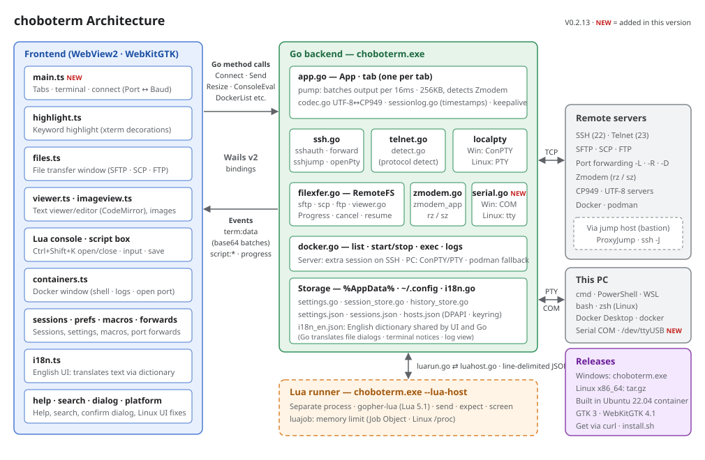

# choboterm V0.2.12

**English** · [한국어](README.ko.md)

An SSH / Telnet / FTP terminal for Windows and Linux that is as simple to use as the old ZTerm.
Built with Go + [Wails v2](https://wails.io) + [xterm.js](https://xtermjs.org). The text viewer uses [CodeMirror 6](https://codemirror.net) (MIT).

**[⬇ Windows (choboterm.exe)](https://github.com/chobocho/choboterm/releases/latest/download/choboterm.exe)** · **[⬇ Linux x86_64 (tar.gz)](https://github.com/chobocho/choboterm/releases/latest/download/choboterm-linux-amd64.tar.gz)** · [Project page](https://chobocho.github.io/choboterm/) · [All releases](https://github.com/chobocho/choboterm/releases)

- **Windows**: No installation needed; just download and run. The executable is not code-signed, so if a "Windows protected your PC" window appears on first launch, click **More info → Run anyway**.
- **Linux**: Extract the archive and run `./choboterm`. Running `./install.sh` registers it in `~/.local/bin` and the application menu.

  ```sh
  curl -LO https://github.com/chobocho/choboterm/releases/latest/download/choboterm-linux-amd64.tar.gz
  tar xzf choboterm-linux-amd64.tar.gz
  cd choboterm-linux-amd64
  ./install.sh                          # ~/.local/bin/choboterm, adds an application menu entry
  setsid ~/.local/bin/choboterm >/dev/null 2>&1 &   # the window stays open after you close the terminal
  ```

  - Requires GTK 3 and WebKitGTK 4.1 (Ubuntu 22.04 · Debian 12 or later): `sudo apt install libgtk-3-0 libwebkit2gtk-4.1-0`
  - Saving passwords works only when a keyring (GNOME Keyring, KWallet, etc.) is available. Without a keyring, passwords are not saved.
  - Window translucency and PuTTY session import are Windows-only. macOS is not supported.


## Features

- **English UI**: Choose Auto / 한국어 / English under "Language (언어)" in the Settings window (`Ctrl+Shift+O`). Auto follows the Windows display language (Korean on Korean Windows, English otherwise). Takes effect after a restart.
  - Menus, windows, notifications, error messages, file dialog titles and the messages shown in the terminal all switch to English. F1 help opens in the UI language at first.
  - There is a single dictionary, `frontend/src/i18n_en.json`, shared by Go and the UI. Terminal output and the contents of files being edited are not translated.
- **Tabs**: Open multiple connections as tabs, like MobaXterm. Each tab has its own connection, encoding and file transfers.
  - Tab status dot: green = connected, gray = disconnected, orange = transferring files. When new output arrives in a tab you are not looking at, its name is highlighted.
  - New tab with the `+` button or by double-clicking an empty area of the tab bar, close with a middle click, drag to reorder
  - The end of the window title shows how the current tab is rendered: `⚡GPU` = GPU accelerated (WebGL), `🐢CPU` = the GPU is not available, so the regular renderer is used (only software WebGL is present, or the GPU was reset)
  - Tab context menu: Reconnect, Duplicate (a new tab to the same server), File transfer, Disconnect, Close tab
  - **Split panes**: Split a tab with `Ctrl+Shift+\` (right, the `|` shape) / `Ctrl+Shift+-` (down) or from the tab context menu. Each new pane connects separately, and its connect window is pre-filled with the current server, so just press `Enter`. You can keep splitting as many times as you like.
    - Click or use `Alt+arrow keys` to move to another pane (only in split tabs; otherwise the arrow keys are passed to the program). The current pane has a blue border.
    - Drag the divider to resize; double-click it to go back to half and half.
    - In the tab bar, the panes of a split tab appear as one group (blue background), each with its own status dot and name. `Ctrl+Shift+W` or ✕ closes only that pane.
  - The connect window and the file transfer window open per tab. You can switch tabs while they are open, and when you come back, the inputs, folders and transfer status are just as you left them. File transfers continue while you look at other tabs.
- **Session management**: Save frequently used connections with a name and a group (one level). Unlike the recent connection history (20 entries), they are never pushed out.
  - Save with `☆ Save` (`Alt+S`) in the connect window or "Save as session" in the tab context menu. Passwords can be saved too, encrypted with Windows DPAPI (only the current Windows user can decrypt them).
  - Sessions appear by group at the top of the ▼ list of the Host field. Typing in the Host field filters by name, address and group, so even with many sessions you can pick one with a few keystrokes.
  - Tabs opened from a session are named after the session.
  - **Sessions window**: `Ctrl+Shift+H` or the ★ button at the right of the tab bar. Edit, add, duplicate, delete and search sessions, and connect with `Enter`. "Open the whole group" opens every session in the group as tabs. Changes are saved immediately.
  - **Import · export**: Import SSH and Telnet sessions saved in PuTTY into a `PuTTY` group. To move to another PC, export to a file and import it there (passwords are not exported).
- **Protocol selection**: 22 = SSH, 21 = FTP, 23 = Telnet. For other ports (e.g. Termux's 8022), the protocol is detected automatically from the server's first greeting right after connecting (`SSH-` → SSH, `220` → FTP, anything else → Telnet). Telnet servers that do not speak first take 2 seconds to detect.
- **SSH**: Password, keyboard-interactive, private keys in `~/.ssh` (id_ed25519 / id_ecdsa / id_rsa), and SSH agent authentication
  - **Two-factor authentication (OTP)**: Questions the server asks via keyboard-interactive, such as `Verification code:`, `One-time password:` or Duo, are shown in a window exactly as the server sent them, and your answer is sent back. The first `Password:` question is answered automatically with Pass from the connect window. If Pass is left empty, the password is asked in the window too.
  - **SSH agent**: Keys loaded in the OpenSSH agent for Windows (the `ssh-agent` service), PuTTY's Pageant, or `SSH_AUTH_SOCK` are tried first. Nothing to configure.
  - **Passphrase-protected private keys**: The passphrase is asked only when the server accepts that key (not on servers where it doesn't fit). A key unlocked once is remembered until choboterm exits, so it is not asked again on reconnect, split panes or automatic reconnection. For old PEM keys that do not contain the public key, the `.pub` file next to it is used; if that is missing too, the passphrase is asked right away when connecting (cancel to skip that key).
  - **Connect by `~/.ssh/config` name**: Type a name from your config (e.g. `busan`) in the Host field, or a command like `ssh busan` or `ssh -p 2222 user@busan`, and `HostName` / `Port` / `User` / `IdentityFile` are read to fill in Port and Login before connecting. The tab name and connection history keep `busan`.
    - When the Host field has focus, a tooltip shows input examples and the registered names; when you type a config name, it shows the actual `user@address:port` it will connect to. Config names also appear in the ▼ list as `ssh config`.
    - The `IdentityFile` key is tried first, then the default keys and the password. Pattern entries like `Host *.corp` are applied too. `Match` is not supported yet.
  - **Jump host (ProxyJump)**: Connect to an internal server through a bastion server. Enter `user@bastion` or `bastion:2222` in the `Jump` field of the connect window (and the Sessions window); chain multiple hops with commas, like `a,b`. If left empty, `ProxyJump` from `~/.ssh/config` is used (shown dimmed in the field), and you can also type `ssh -J bastion web` in the Host field. `none` disables it even if it is in the config.
    - If a jump host name is a Host in the config, its HostName · User · Port · IdentityFile are used. Login uses keys and the agent; if a password is needed, it is asked separately, labeled "(jump host user@bastion)". Host keys are checked against known_hosts at every hop.
    - File transfer (SFTP) and port forwarding go through the same route. The Jump value is saved with the connection history and sessions.
  - Host keys are verified with `~/.ssh/known_hosts`. For a host you connect to for the first time, the fingerprint is shown and you are asked whether to trust it; hosts whose key has changed are blocked.
- **Local shell (cmd / PowerShell / WSL)**: Enter `cmd`, `powershell`, `pwsh` or `wsl` (or with arguments, like `wsl -d Ubuntu`) as the Host in the connect window to open a shell on this PC in a tab. Installed shells also appear in the ▼ list as `Local shell`. The Port / Login / Pass / Code fields are not used then, so they are disabled.
  - Uses the Windows pseudo console (ConPTY), so Windows 10 1809 or later is required. Starts in the user folder and is always UTF-8.
  - Split panes, macros, session logs and scrollback search all work, and in WSL you can transfer files with `sz` / `rz` (Zmodem). When it ends with `exit`, press `Enter` to reopen it.
- **Serial port**: Enter `COM3` (`/dev/ttyUSB0` on Linux) as the Host in the connect window to open a serial port in a tab — for router and switch consoles, embedded boards, Arduino and the like.
  - The Port field becomes the speed (baud, 115200 by default). Data bits, parity, stop bits and flow control go after the name: `COM3 9600 7E1 rtscts`. Parity is N (none) · E (even) · O (odd), flow control is `rtscts` (hardware) · `xonxoff` (software); without them it is 8N1 with no flow control.
  - Ports connected now appear in the ▼ list as `serial`, with the device name (e.g. `USB-SERIAL CH340`). The Login / Pass / Jump fields are not used.
  - Tab right-click → "Send break" sends a break (e.g. to enter Cisco ROMMON). EUC-KR, macros, Lua scripts, session logs and Zmodem (`sz` / `rz`) all work.
  - Unplugging a USB adapter counts as a lost connection and automatic reconnect kicks in, so plugging it back in carries on. A port can be open in one tab at a time.
  - On Linux, if you get a permission error, run `sudo usermod -aG dialout $USER` and log in again.
- **Telnet**: NAWS / TTYPE / ECHO / SGA / BINARY negotiation, automatic login at `login:` / `password:` prompts
  - The password is remembered and filled in automatically when you pick the Host. It is stored encrypted with Windows DPAPI, so only the current Windows user can decrypt it. Connecting with Pass empty deletes the saved password.
- **FTP**: The file transfer window opens as soon as you connect. Closing the window keeps the connection until the tab is closed; reopen it with `Ctrl+Shift+F`. If Login is left empty, you log in as anonymous.
- **SFTP / SCP**: While connected via SSH, open the file transfer window with `Ctrl+Shift+F`. No need to log in again.
  - It opens in the terminal's current folder. The folder is found from the prompt on the cursor line (`user@host:~/src$`, `~/src $`, etc.), the OSC 7 sent by the shell, and the window title, in that order; if none is found, it opens in the home folder.
- **File transfer window** (common to SFTP / SCP / FTP)
  - Select multiple items with `Ctrl+click` / `Shift+click` / `Ctrl+A` to download or delete them at once.
  - When downloading several items or folders, pick a destination folder and subfolders are downloaded too. If a file with the same name exists, it is saved as `name (1)`.
  - Drag files and folders from Windows Explorer onto the list to upload them (folders including their contents).
  - `Delete` to delete (folders including their contents, after confirmation), `F2` rename, `F7` new folder, `Shift+F4` new file (empty; not created if the name exists), context menu
  - `F3` view / `F4` edit: Opens a remote text file directly without downloading it (up to the first 10MB; larger files are view-only). UTF-8 / EUC-KR (CP949) is detected automatically, and if characters are garbled you can pick an encoding to reload it. `Ctrl+F` find and replace, word wrap on/off, and you can save what you see to your PC converted to UTF-8 or EUC-KR.
  - Images (JPG · PNG · GIF · BMP · WebP · SVG · ICO, up to 30MB) open in the image viewer with `F3`. They are fitted to the window at first; `←` `→` (`PgUp` `PgDn`, `Space`) for the previous / next image in the same folder, `0` fit, `1` actual size (toggle with a double-click), `+` `-` · `Ctrl+wheel` to zoom in and out, drag to pan large images, `Esc` to close. Transparent areas are shown as a checkerboard.
  - Edits are saved straight to the server with `Ctrl+S`. The encoding, line endings (CRLF/LF) and BOM are preserved. If the file changed on the server after you opened it (size · modification time), you are asked before overwriting, and if there are characters the encoding cannot represent or garbled characters, you are told before saving.
  - **Resume download · resume upload** (SFTP · FTP): A file being downloaded is saved as `name.part` and renamed to the original name when complete. If a `.part` is left behind because the connection dropped or you cancelled, the next time you download the same file to the same place you are asked "Resume / Start over", and it continues from where it stopped. A file whose upload was interrupted also asks "Resume upload / Start over" when uploaded again (only until choboterm is restarted, and only for the same local file — because a smaller file on the server might be an old version).
  - If the server has no SFTP (Dropbear, routers, embedded devices, etc.), SCP is used automatically. Folder listings are then obtained with `ls`.
- **Zmodem**: Running `sz file` / `rz` in the terminal starts the transfer automatically. lrzsz must be installed on the remote server.
- **EUC-KR (CP949)**: The legacy Korean encoding used by old Korean BBSes and servers. Choose it in Code in the connect window, or toggle with `Ctrl+Shift+E` while connected.
  - In EUC-KR mode, special characters like `─ │ ■ ○ ※` are drawn two cells wide, as on old terminals.
  - The font is chosen per encoding in the Settings window (default: UTF-8 = D2Coding, EUC-KR = GulimChe). Even if you choose D2Coding or similar for EUC-KR, symbols like `▒ ─ ■` are drawn with GulimChe so they join without gaps.
  - The same encoding applies to FTP file names and Zmodem file names.
- **Copy / paste**: Like PuTTY, selecting with the mouse copies immediately and right-clicking pastes. `Ctrl+Shift+C` / `Ctrl+Shift+V` work too.
  - When pasting multiple lines, each line may run as a command, so the content is shown first for confirmation. You can turn this off with "Don't ask again".
  - In programs that use the mouse, such as mc or htop, paste with Shift+right-click.
- **Font size**: Change with `Ctrl+wheel`, `Ctrl+=` / `Ctrl+-` and reset with `Ctrl+0`. Applies to all tabs and is kept for the next launch.
- **Keyword highlighting**: Words in the output such as `error` · `fail` · `오류` · `실패` get a red background, `warning` · `경고` yellow, and `success` · `성공` green. Change the words for each color (comma-separated) or turn it off under "Keyword highlighting" in the Settings window (`Ctrl+Shift+O`).
  - English words are matched as whole words, case-insensitively (`error` matches `Error` but not `errorless`). Korean words are highlighted whenever they appear.
  - The output sent by the server is not modified; highlights are only painted on top of the screen, so the program's colors stay the same and log files are unaffected. Nothing is highlighted inside full-screen programs such as vim · htop.
- **Scrollback search**: Open the search bar with `Ctrl+Shift+S`. It searches from the most recent output as you type and highlights all matches. `Enter` goes up (earlier output), `Shift+Enter` down, `Alt+C` toggles case sensitivity, `Alt+R` regular expressions.
- **Open links**: `Ctrl+click` an `http://` / `https://` address on screen to open it in the default browser. A plain click is left for selecting.
- **Keepalive / automatic reconnection**: Sends `keepalive@openssh.com` for SSH and NOP for Telnet every 60 seconds so routers and firewalls don't drop idle connections; after 3 missed responses in a row, the connection is considered lost.
  - When the network drops, it reconnects up to 10 times at intervals of 3 · 5 · 10 · 20 · 30 seconds. The screen contents are kept. `Enter` connects right away, `Esc` cancels.
  - Connections the server ended normally, such as with `exit`, are not reconnected.
- **Settings window**: `Ctrl+Shift+O` or the ⚙ button at the right of the tab bar. Change the font (per UTF-8 / EUC-KR) and size, color theme, cursor shape (block / underline / bar) and blinking, scrollback lines (default 5000), multi-line paste confirmation, keepalive interval (0 = off), automatic reconnection, and session logging (automatic logging, plain text, folder).
- **Port forwarding (SSH)**: Open the port forwarding window with `Ctrl+Shift+P` or from the tab context menu.
  - Local (`-L`): a port on this PC → through the server → to the target. E.g. `127.0.0.1:15432 → localhost:5432` to reach the database on the server
  - Remote (`-R`): a port on the server → through this PC → to the target
  - Dynamic (`-D`): a port on this PC becomes a SOCKS5 proxy that connects through the server
  - Rules are saved per host in the connection history and reopened automatically on the next connection (including automatic reconnection). If a port is already in use, the rule is kept and an error is shown.
  - When several tabs are open to the same server, only one tab listens for a rule and the others show "Standby". If the listening tab disconnects, a standby tab takes over, and adding or deleting a rule in any tab applies to all tabs.
  - The target is the address as seen from the server. E.g. Jupyter (8888) listening only on `localhost` on the server: `127.0.0.1:8888 → 127.0.0.1:8888`
  - The status column shows the number of currently open connections, and the bottom of the window shows the equivalent `ssh` command (including `-L`/`-R`/`-D`, `-J`, `-p`) for you to copy.
- **Docker containers**: Open the containers window with `Ctrl+Shift+J` or from the tab context menu. It shows the containers on the current tab's SSH server, or on this PC (Docker Desktop). If docker is not available, podman is used.
  - **Open shell** (`Enter` / double-click): `docker exec -it` in a new tab (bash if available, otherwise sh). **View log**: `docker logs -f --tail 200` in a new tab
  - Container tabs for a server open one more session on that tab's SSH connection, so you don't log in again. They close together when the original tab's connection drops, and reopen with `Enter` (if the original tab is gone, another tab connected to the same server is used).
  - Start / stop / restart (stop and restart after confirmation), show stopped containers, refresh (`F5`)
  - **Open port**: Forwards a published port on the server to the same port on this PC (`-L`) and opens it in the browser. For containers on this PC, it opens `http://localhost:port` directly.
  - If the server user is not in the docker group, a permission error is shown along with a hint to run `sudo usermod -aG docker $USER`.
- **Macros**: Open the macro window with `Ctrl+Shift+M` to save frequently used commands and send them (`Enter` / double-click in the list).
  - Assign one of `F2`–`F12`, `Shift+F1`–`F12` or `Ctrl+F1`–`F12` to a macro to send it with that key. Keys not assigned are passed through unchanged to programs such as mc or htop.
  - Line breaks in the content are sent as `Enter`, and you can use `\t` (Tab), `\e` (Esc), `\xHH` (e.g. `\x03` = Ctrl+C) and `\\` (backslash).
- **Lua scripts**: Automate tasks that watch the output and type input, such as automatic login or repeated commands, with Lua (5.1 syntax, [gopher-lua](https://github.com/yuin/gopher-lua)).
  - If you set the type to "Lua script (runs in the tab)" in the macro window, that macro (including its assigned F key) runs as a script. "Run Lua script..." in the tab context menu runs a `.lua` file from `Documents\choboterm\scripts` (3 examples are placed there the first time it opens).
  - Available functions: `send(string)` sends input (`"\r"` = Enter), `expect(pattern, seconds)` waits until a Lua pattern appears in the output (compared with colors and control codes removed; returns `nil` on timeout, default 30 seconds), `sleep(milliseconds)`, `screen()` the text currently on screen, `print(...)`. Also `string` · `table` · `math` · `os.time/clock/date`; files (`io`), running commands and `require` are not available.
  - **Lua console** (`Ctrl+Shift+K` or tab context menu → "Lua console"): A REPL that runs each line as you enter it. It opens at the bottom right of the window, and variables and functions persist until you close it. Enter an expression like `1 + 2` or `x` to see its value; `print` output appears in place as well. `Enter` runs, `Shift+Enter` inserts a line break, `↑` `↓` recall previous input, `Ctrl+C` (or "Stop") stops only the running input (the console and variables remain). `Ctrl+O` (or "Open") loads a Lua file into the input box so you can see it (edit it, then run with `Enter`), and `Ctrl+S` (or "Save") saves all input and output so far to a text file. `Esc` returns to the terminal; ✕ or pressing `Ctrl+Shift+K` again closes it (code still running is stopped). Drag the top border with the mouse to change its height (minimum: title bar, input line and 3 lines of output; maximum: 80% of the window height), and the height is kept the next time it opens. In the console, `expect` only sees output produced after the input was run.
  - A tab running a script shows the elapsed time, like `▶ 0:42`, and a box at the bottom right of the window shows `print` output and the result (finished · stopped · error with line number). Errors stay until closed. To stop, use tab context menu → "Stop script". The script also stops if the connection drops or the tab is closed.
  - **Scripts cannot freeze choboterm**: Scripts run in a separate process (`choboterm.exe --lua-host`) with memory limited to 256MB. An infinite loop, runaway memory or an error ends only that script and the terminal carries on. Even if a script cannot keep up with the output, the terminal display does not slow down.
- **Session log**: With `Ctrl+Shift+L` or the tab context menu, everything the tab receives is continuously saved to a file. Tabs being logged get a red dot.
  - The file is created as `Documents\choboterm\logs\host_port_date_time.log`. Change the folder in the Settings window. "Open the log folder" in the tab menu opens it in Explorer.
  - Plain text is the default: color and control codes are removed, and progress indicators overwritten with `\r` keep only their final state. If you turn this off in Settings, the output is saved as received (including escape codes), so you can view it again with `cat`.
  - Turning on "Start logging on every connection" in Settings creates a new file for each SSH · Telnet connection. Reconnecting keeps appending to the same file until the tab is closed, with separator lines marking connect and disconnect times.
  - **Timestamp per line**: Prefixes each line with the time it started arriving, in the format `[2026-10-09 21:30:15.123] ` (down to milliseconds). Useful for incident analysis to know when output appeared. On by default; turn it off with "Time at the start of each line" in the Settings window. It is also added when saving raw output (with color and control codes).
- **Color themes**: Choose in the Settings window and it applies to all tabs immediately. Available: Default (black), Campbell (Windows Terminal), PuTTY, Tango Dark, One Half Dark, Dracula, Gruvbox Dark, Solarized Dark, the light-background Solarized Light / One Half Light, and, for an old green-monitor feel, Hercules (green on black) and Hercules inverse (black on green). A preview of the 16 colors is shown while you choose.
  - **Per-server theme**: Choose under "Color theme (this server)" in the tab context menu to save it for that server (host + port), so it opens with the same theme when you reconnect, duplicate or split. It also applies immediately to other tabs connected to the same server. Handy for giving production servers a different color. Choosing "Default" returns to the theme from the Settings window.
- **Translucency**: Choose under "Translucency" in the Settings window and adjust the opacity (20–100%) with a slider. Changes show while you move the slider, and cancelling restores the original.
  - **Whole window**: Like Xshell · Tera Term, the tab bar and terminal, text included, are see-through. Popups such as the Settings · connect · question · file windows and menus stay opaque. The title bar is drawn by Windows, so it stays opaque.
  - **Background only**: Like Windows Terminal, only the terminal background is see-through and the text stays sharp. To keep text sharp, this mode does not use GPU acceleration by default (🐢CPU in the window title). Turn on "Draw with the GPU in background-only mode too" to render with the GPU (⚡GPU; faster, but text may be a little rough).
  - Both modes apply immediately without a restart.
- **Window position memory**: The window size, position and maximized state are saved on close and restored on the next launch. If the saved position is off screen, for example after unplugging a monitor, the window is moved to a visible spot.
- **Recent connection history**: The Host list keeps the last 20. Passwords are stored for Telnet only, encrypted. Per-server color themes and port forwarding rules are not deleted when an entry drops out of the history.

X11 forwarding is not supported.

## Keyboard shortcuts

| Key | Action |
|---|---|
| `Enter` (in a tab with no connection) | Open the connect window in that tab |
| `Ctrl+Shift+T` / `Ctrl+Shift+N` | Connect in a new tab |
| `Ctrl+Tab` / `Ctrl+Shift+Tab` (`Ctrl+PgDn` / `Ctrl+PgUp`) | Next / previous tab |
| `Ctrl+Shift+W` | Close tab (in a split tab, only the current pane) |
| `Ctrl+Shift+\` / `Ctrl+Shift+-` | Split pane right / down |
| `Alt+←` `→` `↑` `↓` (in a split tab) | Move to the adjacent pane |
| `Alt+C` / `Alt+A` / `Alt+S` / `Esc` | In the connect window: Connect / Cancel / Save as session / Close |
| `Ctrl+Shift+H` | Sessions window |
| `Ctrl+Shift+K` | Open / close the Lua console |
| `Ctrl+Shift+D` | Disconnect (keeps the tab) |
| `Ctrl+Shift+E` | Toggle UTF-8 ↔ EUC-KR |
| `Ctrl+Shift+F` | File transfer window (SFTP / SCP / FTP) |
| `Ctrl+wheel` / `Ctrl+=` / `Ctrl+-` / `Ctrl+0` | Font larger / smaller / default |
| `Ctrl+Shift+S` | Scrollback search |
| `Ctrl+Shift+O` | Settings window |
| `Ctrl+Shift+M` | Macro window (send directly with the F key assigned to a macro) |
| `Ctrl+Shift+P` | SSH port forwarding window |
| `Ctrl+Shift+J` | Docker containers window |
| `Ctrl+Shift+L` | Start / stop session logging |
| `Ctrl+click` | Open a URL on screen in the browser |
| `Ctrl+Shift+C` / `Ctrl+Shift+V` | Copy / paste (mouse selection = copy, right-click = paste) |
| `Ctrl+C` / `Ctrl+X` (during a Zmodem transfer) | Cancel the transfer |
| `F1` | Open / close help (in the help window, `Alt+L` toggles 한국어 ↔ English) |

File transfer window: `↑` `↓` `Home` `End` to select (`Shift` for a range), `Ctrl+click` · `Ctrl+A` to select multiple, `Enter` / double-click to open a folder or download, `Backspace` · `Alt+↑` · `..` at the top of the list for the parent folder, `F3` view, `F4` edit, `F5` refresh, `Delete` delete, `F2` rename, `F7` new folder, `Shift+F4` new file, `Esc` close

## Where files are stored

- Downloads (SFTP / SCP / FTP): chosen in the save dialog. The default location is `~/Downloads`.
- Zmodem receive: saved to `~/Downloads`. If a file with the same name exists, it is saved as `name (1).ext`.
- Connection history: `%AppData%\choboterm\hosts.json` (Telnet passwords are stored only as DPAPI-encrypted values)
- Sessions, per-server color themes and port forwarding: `%AppData%\choboterm\sessions.json` (passwords are stored only as DPAPI-encrypted values)
- Settings: `%AppData%\choboterm\settings.json`
- Session logs: `Documents\choboterm\logs` (changeable in the Settings window)
- On Linux, `~/.config/choboterm` is used instead of `%AppData%\choboterm`, and `~/Documents` instead of `Documents`. Passwords are encrypted with AES-GCM using a key kept in the keyring.

## Build

Requirements: Go 1.26 or later, Node.js, Wails CLI v2, WebView2 runtime (included with Windows 11)

```sh
go install github.com/wailsapp/wails/v2/cmd/wails@latest

wails dev     # development mode (hot reload)
wails build   # produces build/bin/choboterm.exe
```

Running `build.bat` does tests → `wails build` → copying to `release\choboterm.exe` in one go. (The `release` folder is not committed to git.)

The Linux version is built with `build_linux.sh`, which produces `release/choboterm-linux-amd64.tar.gz`. To run on older distributions, it tests and builds inside an Ubuntu 22.04 Docker container (`tools/linux/Dockerfile`); with `--native`, it builds with this machine's Go and libraries (`libgtk-3-dev`, `libwebkit2gtk-4.1-dev`). On Windows, run it in WSL (the frontend reuses the `frontend/dist` built by `build.bat`).

```sh
wsl -- ./build_linux.sh
```

## Release

1. Bump `AppVersion` in `main.go` and `productVersion` in `wails.json`.
2. Build `release\choboterm.exe` with `build.bat`, then `release/choboterm-linux-amd64.tar.gz` with `wsl -- ./build_linux.sh`. (Quit any running choboterm first.)
3. Commit and push, then create a GitHub Release.

   ```sh
   gh release create v0.2.0 "release/choboterm.exe#choboterm.exe (Windows x64)" "release/choboterm-linux-amd64.tar.gz#choboterm-linux-amd64.tar.gz (Linux x86_64)" --title "choboterm V0.2.0" --notes "..."
   ```

The download button on the project page (`docs/`, served by GitHub Pages from the `main` branch `/docs`) always points to the latest release's `choboterm.exe`, so it needs no changes.

## Tests

```sh
go test ./...
```

Tests that need a real server run only when the environment variables are set.

- FTP: a server with `한글파일.txt` (content `hello`) and an empty `sub` folder at the root, accepting login as `user` / `pass`

  ```sh
  CHOBOTERM_FTP_TEST=127.0.0.1:2121 CHOBOTERM_FTP_ENCODING=EUC-KR go test -run FTP -v
  ```

- Zmodem: transfers files for real with lrzsz `sz` / `rz` in WSL. You can just extract the package without installing it.

  ```sh
  wsl -- sh -c 'mkdir -p /tmp/lrzsz && cd /tmp/lrzsz && apt-get download lrzsz && dpkg -x lrzsz_*.deb x'
  CHOBOTERM_LRZSZ=/tmp/lrzsz/x/usr/bin go test -run Zmodem -v
  ```

  In Git Bash, also set `MSYS2_ENV_CONV_EXCL=CHOBOTERM_LRZSZ` so the `/tmp` path is not converted.

- Connecting to a real SSH server (any port): checks shell commands, window resizing and file listing. The host key is saved to a temporary known_hosts.

  ```sh
  CHOBOTERM_SSH_TEST=host:8022 CHOBOTERM_SSH_USER=user CHOBOTERM_SSH_PASS=secret go test -run LiveSSH -v
  ```

- Automatic SCP fallback: starts a test SSH server that only runs commands without SFTP, and runs the commands in WSL (`scp` and `ls` required in WSL).

  ```sh
  CHOBOTERM_WSL=1 go test -run SCPFallback -v
  ```

- Docker: checks the list, actions and exec tabs with the same kind of test SSH server and a fake `docker` script in WSL.

  ```sh
  CHOBOTERM_WSL=1 go test -run DockerRemote -v
  ```

- Real Docker: create the containers first (see the comments in `docker_live_test.go` for the commands), then the server side is checked over SSH and the "This PC" side with `docker` on the PATH. With `docker.io` and `openssh-server` installed in WSL, a single PC can check both (for the "This PC" side, point the Windows docker CLI at WSL's Docker with `DOCKER_HOST`).

  ```sh
  CHOBOTERM_DOCKER_SSH=localhost:22 CHOBOTERM_DOCKER_USER=me CHOBOTERM_DOCKER_KEY=~/.ssh/id_ed25519 go test -run DockerLive -v
  CHOBOTERM_DOCKER_LOCAL=1 go test -run DockerLocalLive -v
  ```

## Architecture



- The UI is handled by TypeScript (xterm.js) inside WebView2; connections, file transfer and storage are handled by Go. The two communicate through Wails bindings (Go method calls) and events.
- Each tab has one `tab` on the Go side, and server output is batched in 16ms · 256KB units and sent as `term:data` events. Encoding conversion, Zmodem detection, session logging and forwarding to Lua scripts happen at the same time.
- Lua scripts run in a separate process launched as `choboterm.exe --lua-host`, so the app is unaffected even if a script hangs or uses up its memory.
- SSH can go through jump hosts (`sshjump.go`): at each hop, it logs in to the next server over a channel of the previous connection.
- Keyword highlighting (`highlight.ts`) does not modify server output; it paints only on top of the screen with xterm decorations.
- Docker containers (`docker.go`, `containers.ts`): on a server, one more session is opened on the tab's SSH connection to run `docker ps` · `docker exec`, so there is no need to log in again. On this PC, Docker Desktop's `docker` is run directly, and shell tabs are opened with ConPTY.
- For the English UI, the single dictionary `i18n_en.json` is shared by the UI (`i18n.ts`, translates text as it appears) and Go (`i18n.go`, file dialogs, terminal messages, logs).

## Source layout

| File | Contents |
|---|---|
| `app.go` | Per-tab connections, key input forwarding, batched output, Zmodem detection |
| `ssh.go` / `telnet.go` / `ftp.go` / `sftp.go` / `scp.go` | Protocols |
| `detect.go` | Automatic protocol detection on non-standard ports |
| `forward.go` | SSH port forwarding (-L / -R / -D SOCKS5) |
| `localshell*.go` · `localpty_windows.go` · `localpty_linux.go` | Local shell tabs (Windows: cmd · PowerShell · WSL via ConPTY; Linux: bash · zsh etc. via PTY) |
| `docker.go` | Docker container list and actions, `docker exec` / `docker logs` tabs (server: same SSH connection; PC: local PTY) |
| `filexfer.go` | Common file transfer layer (RemoteFS), progress, cancellation |
| `zmodem.go` / `zmodem_app.go` | Zmodem protocol and its app integration |
| `codec.go` | UTF-8 ↔ CP949 conversion |
| `history_store.go` | Recent connection history |
| `session_store.go` | Saved sessions, per-server settings (color theme · port forwarding) |
| `session_import.go` / `putty_windows.go` | Session import · export, reading PuTTY sessions |
| `settings.go` | User settings (`settings.json`) |
| `window_windows.go` | Saving and restoring window size and position (Win32 WINDOWPLACEMENT) |
| `secret_windows.go` · `secret_linux.go` | Password encryption (Windows DPAPI; Linux AES-GCM with a key from the keyring) |
| `frontend/src/main.ts` | Tabs, terminal, connect window, shortcuts |
| `frontend/src/files.ts` | File transfer window (multi-select, drag-and-drop upload, delete · rename · new folder), progress box |
| `frontend/src/viewer.ts` / `viewer.go` | Text viewer · editor (CodeMirror, automatic / forced encoding, saving to the server · conflict check, converted save) |
| `frontend/src/dialog.ts` | Confirmation / name input dialogs |
| `luahost.go` / `luarun.go` | Lua scripts: the runner in a separate process and the app-side manager (output forwarding, input send limits, stop · force kill) |
| `luajob_windows.go` · `luajob_linux.go` | Memory limit for the script process (Windows Job Object; Linux watches `/proc`) |
| `build_linux.sh` · `tools/linux/` | Linux build (Ubuntu 22.04 container) and tar.gz packaging (install script, desktop entry) |
| `frontend/src/platform.ts` | Current OS (hides Windows-only items on Linux) |
| `frontend/src/sessions.ts` | Save-session window, Sessions window, import · export |
| `frontend/src/help.ts` | F1 help window (한국어 / English) |
| `frontend/src/search.ts` | Scrollback search bar |
| `frontend/src/prefs.ts` | Settings window |
| `frontend/src/forwards.ts` | Port forwarding window |
| `frontend/src/containers.ts` | Docker containers window |
| `frontend/src/macros.ts` | Macro window, macro shortcuts, escape handling |
| `frontend/src/paste.ts` | Multi-line paste confirmation dialog |
| `frontend/src/settings.ts` | Loading / saving settings |
| `frontend/src/i18n.ts` / `i18n.go` / `frontend/src/i18n_en.json` | English UI: replaces Korean text using the dictionary (UI as text appears; Go for dialogs, terminal messages, logs) |
| `frontend/src/highlight.ts` | Keyword highlighting (xterm decorations) |
| `frontend/src/imageview.ts` | Image viewer window |
| `sshjump.go` | Jump host (ProxyJump) |
| `serial*.go` | Serial port (Windows: COM ports · Linux: termios) |
| `frontend/src/cjkwidth.ts` | Double-width character handling in EUC-KR mode |
| `tools/make_icon.py` | App icon generation (`build/appicon.png`, `build/windows/icon.ico`) |

## Not supported yet

- X11 forwarding
- FTPS (TLS)
- Resume for SCP (SFTP · FTP only)
- macOS

## License

[MIT](LICENSE)

The full license texts of third-party software included in choboterm.exe (Wails, xterm.js, CodeMirror, Go libraries, etc.) are in [THIRD_PARTY_NOTICES.txt](THIRD_PARTY_NOTICES.txt). After changing dependencies, regenerate it with `python tools/gen_notices.py`.
